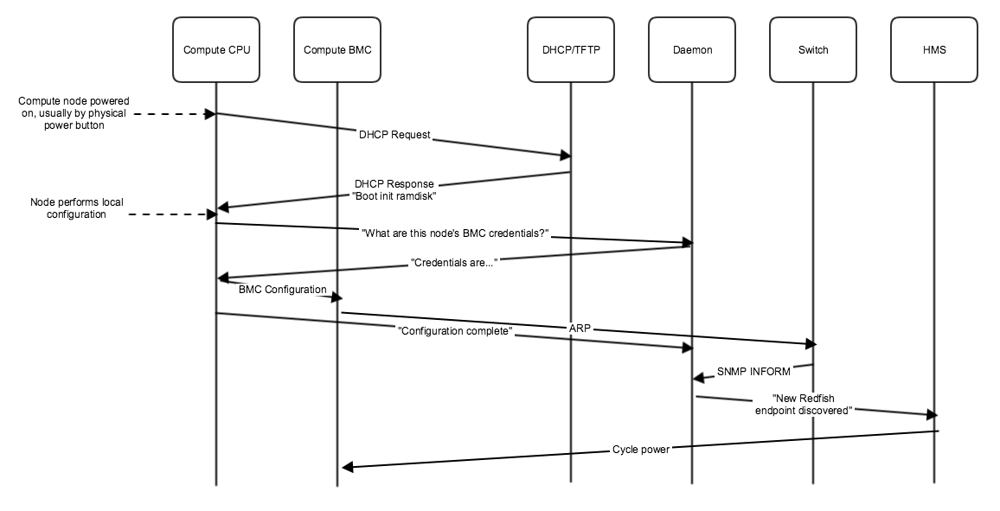
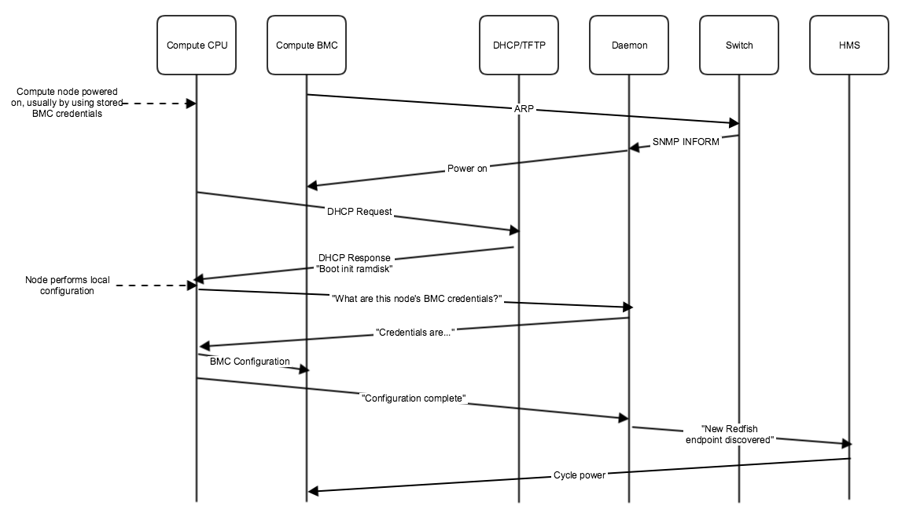
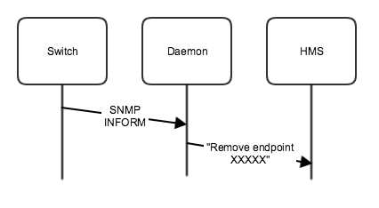
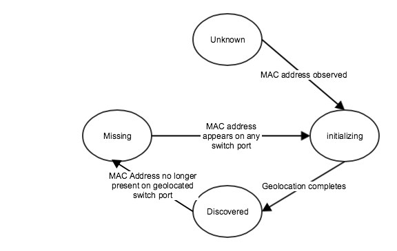

1.  [CASMHMS](index.html)
2.  [CASMHMS Home](CASMHMS-Home_119901124.html)
3.  [Design Documents](Design-Documents_127906417.html)

#  CASMHMS : River Endpoint Discover Service (HMS) 

Created by  Steven Presser, last modified on
Feb 04, 2019

Certain elements of this
documentation (anything about SNMP INFORMs) are out of date.  If there
is need of an updated version,
ask <a href="https://connect.us.cray.com/confluence/display/~spresser" class="confluence-userlink user-mention">Steven Presser</a>.  
  

<table class="wrapped confluenceTable">
<tbody>
<tr class="header">
<th class="confluenceTh">Version</th>
<th class="confluenceTh">Date</th>
<th class="confluenceTh">Editor</th>
<th class="confluenceTh">Notes</th>
</tr>

<tr class="odd">
<td class="confluenceTd">0.1</td>
<td class="confluenceTd">7/30/18</td>
<td class="confluenceTd">

<a href="https://connect.us.cray.com/confluence/display/~spresser" class="confluence-userlink user-mention">Steven Presser</a>

</td>
<td class="confluenceTd">Initial draft</td>
</tr>
<tr class="even">
<td class="confluenceTd">0.2</td>
<td class="confluenceTd">8/6/18</td>
<td class="confluenceTd">

<a href="https://connect.us.cray.com/confluence/display/~spresser" class="confluence-userlink user-mention">Steven Presser</a>

</td>
<td class="confluenceTd">
Added Swagger API details
</td>
</tr>
<tr class="odd">
<td class="confluenceTd">0.3</td>
<td class="confluenceTd">8/14/18</td>
<td class="confluenceTd"><a href="https://connect.us.cray.com/confluence/display/~spresser" class="confluence-userlink user-mention">Steven Presser</a></td>
<td class="confluenceTd">Updated API to handle BMCs with multiple MAC addresses/channels</td>
</tr>
</tbody>
</table>

# Table of Contents

-   [Table of
    Contents](#RiverEndpointDiscoverService(HMS)-TableofContents)
-   [Introduction](#RiverEndpointDiscoverService(HMS)-Introduction)
-   [Prerequisites](#RiverEndpointDiscoverService(HMS)-Prerequisites)
    -   [Compute Node](#RiverEndpointDiscoverService(HMS)-ComputeNode)
    -   [Switch](#RiverEndpointDiscoverService(HMS)-Switch)
-   [Compute Node Preconfiguration/Items which will be
    Configured](#RiverEndpointDiscoverService(HMS)-ComputeNodePreconfiguration/ItemswhichwillbeConfigured)
-   [Overview/Technologies in
    Use](#RiverEndpointDiscoverService(HMS)-Overview/TechnologiesinUse)
-   [Process](#RiverEndpointDiscoverService(HMS)-Process)
    -   [System-wide
        configuration](#RiverEndpointDiscoverService(HMS)-System-wideconfiguration)
    -   [Stored State](#RiverEndpointDiscoverService(HMS)-StoredState)
    -   [Discovering a node (new to
        system)](#RiverEndpointDiscoverService(HMS)-Discoveringanode(newtosystem))
    -   [Discovering a node (previously configured by
        system)](#RiverEndpointDiscoverService(HMS)-Discoveringanode(previouslyconfiguredbysystem))
    -   [Undiscovering/removing a
        node](#RiverEndpointDiscoverService(HMS)-Undiscovering/removinganode)
-   [Node discovery state
    machine](#RiverEndpointDiscoverService(HMS)-Nodediscoverystatemachine)
-   [Daemon Workflow](#RiverEndpointDiscoverService(HMS)-DaemonWorkflow)
-   [Security](#RiverEndpointDiscoverService(HMS)-Security)
-   [APIs](#RiverEndpointDiscoverService(HMS)-APIs)
    -   [Data
        Structures](#RiverEndpointDiscoverService(HMS)-DataStructures)
        -   [BMCCredentials](#RiverEndpointDiscoverService(HMS)-BMCCredentials)
        -   [BMCCredentialsExtended](#RiverEndpointDiscoverService(HMS)-BMCCredentialsExtended)
        -   [SystemMACAddresses](#RiverEndpointDiscoverService(HMS)-SystemMACAddresses)
    -   [Credentials
        Endpoints](#RiverEndpointDiscoverService(HMS)-CredentialsEndpoints)
        -   [/credentials](#RiverEndpointDiscoverService(HMS)-/credentials)
            -   [POST](#RiverEndpointDiscoverService(HMS)-POST)
        -   [/credentials/by-mac/{mac}](#RiverEndpointDiscoverService(HMS)-/credentials/by-mac/%7Bmac%7D)
            -   [GET](#RiverEndpointDiscoverService(HMS)-GET)
        -   [/credentials/by-xname/{xname}](#RiverEndpointDiscoverService(HMS)-/credentials/by-xname/%7Bxname%7D)
            -   [GET](#RiverEndpointDiscoverService(HMS)-GET.1)
    -   [Discovery
        Endpoint](#RiverEndpointDiscoverService(HMS)-DiscoveryEndpoint)
        -   [PUT
            /discovery](#RiverEndpointDiscoverService(HMS)-PUT/discovery)
    -   [Administrative
        Endpoints](#RiverEndpointDiscoverService(HMS)-AdministrativeEndpoints)
        -   [/admin/credentials](#RiverEndpointDiscoverService(HMS)-/admin/credentials)
            -   [GET](#RiverEndpointDiscoverService(HMS)-GET.2)
            -   [DELETE](#RiverEndpointDiscoverService(HMS)-DELETE)
        -   [/admin/port\_xname\_map](#RiverEndpointDiscoverService(HMS)-/admin/port_xname_map)
            -   [GET](#RiverEndpointDiscoverService(HMS)-GET.3)
            -   [POST](#RiverEndpointDiscoverService(HMS)-POST.1)
    -   [Swagger API
        File](#RiverEndpointDiscoverService(HMS)-SwaggerAPIFile)
-   [Open Questions](#RiverEndpointDiscoverService(HMS)-OpenQuestions)
-   [Conclusion](#RiverEndpointDiscoverService(HMS)-Conclusion)

# Introduction

This document details the plan of record for Shasta River node
initialization, geolocation and Redfish endpoint discovery.  This
process covers several intimately related tasks and in order to
disambiguate we define the following tasks:

1.  Initialization: the process of configuring the basic setting
    required on all River nodes.  At this time, the configuration
    primarily is BMC configuration so that the node can be used in the
    system.  A detailed discussion of these settings is below.
2.  Geolocation: the process of determining where in the system the node
    is located.  This process requires a
    pre-built table mapping physical location (defined as the tuple of
    (switch, port)) to an x-name.
3.  Endpoint discovery: the process of adding the now-configured Redfish
    endpoint to the system
4.  Endpoint maintenance: the process of monitoring endpoints to
    determine when an endpoint may have been physically relocated and to
    re-do geolocation and discovery

Explicitly out of scope is discovering the MAC addresses of the compute
node's NICs – this should be done using the redfish endpoint that will
be brought up at the end of this discovery process.

It is expected that these tasks will need to be performed both at Cray
Manufacturing and at the customer site.  Therefore, this document covers
the plan of record to fulfill the two following use cases:

-   As a member of Cray Manufacturing, I want to be able to build river
    racks without having to note the MAC addresses or other hardware
    identifiers of  hardware placed in River
    racks.  I also do not want to have to power up nodes in a
    specific sequence.
-   As a customer systems
    administrator, I want to be able to remove, replace, or move
    hardware without having to run commands in the Cray management
    system.

It follows from these use cases that the software outlined here will run
both on the Cray Manufacturing floor and on systems after delivery to
the customer.

Additionally, the components of this software which do not run on
compute nodes will be run within the Docker-managed portions of the SMS
cluster.

  

# Prerequisites

## Compute Node

In order to fit with this plan, the compute nodes must:

-   Have BMCs which support IPv6 (specifically
    with SLAAC IP address configuration) and Redfish
-   PXE-boot by
    default
-   Be a supported CPU architecture

The goal of these requirements is explicitly to maximize the number of
configurations which will work without broadening the requirements so
much as to be useless.  These requirements should work with most default
server configurations from multiple manufacturers across multiple
architectures (Intel, AMD, and quite probably ARM).  Ideally such
flexibility could enable us to skip in-house customization of servers
before shipping them – or even enable shipment of replacement hardware
directly to customers with no need for Cray to handle the hardware at
all.

## Switch

In order to fit with this scheme, switches must be configured with:

-   SNMP traps/INFORMs enabled
-   SNMP delivery configured to deliver to a daemon running either on
    the top of rack controller or on the SMS cluster
-   Must be able to communicate SNMP traps/INFORMs to a daemon running
    on the SMS cluster
-   Be wired as specified in the system design documents (eg: CCD file)

# Compute Node Preconfiguration/Items which will be Configured

Although the following items will be configured by the initialization
process, it is ideal if the hardware comes from the manufacturer (or
Cray manufacturing) with the following settings preconfigured:

-   All BMC channels configured to perform DHCP address configuration
    for both IPv4 and IPv6
-   All BMC channels configured to enable "Gratuitous ARP"
-   IPMI Serial-over-LAN enabled and configured
-   Configured to PXEboot as the first boot item

# Overview/Technologies in Use

The solution to this problem requires two major components:

-   A ramdisk, booted on the
    compute nodes, to manage initial configuration of the nodes
-   A daemon, running either on the Top of Rack server or in the SMS
    cluster.  The daemon serves two roles:
    -   To perform geolocation of new or rediscovered nodes and add said
        nodes to the HMS Redfish Endpoint list
    -   To monitor for new, removed and moved endpoints

In terms of technology used:

-   The ramdisk is a Cray-built minimal ramdisk, which simply boots and
    performs configuration.  For security reasons, no information
    transmitted out of the ramdisk can be trusted and no information
    sent to the ramdisk may enable access to other nodes or to the wider
    management system.  Ramdisk tasks will include:
    -   Configuration of BMC credentials.  These credentials will be
        randomly generated by the daemon and assigned on a per-node
        basis.  They are regenerated whenever the node is re-initialized. 
        For security reasons, these credentials must be random, not
        based on the MAC address or other exposed information about the
        node.  The daemon should also track some number of previous
        credentials (including at least one set of "known-good"
        credentials) to attempt to use if nodes get "stuck" or otherwise
        become out of sync with the daemon.
    -   Configuration of the BMC for the network.  BMCs should be
        configured to enable IPv6 (with SLAAC address configuration),
        and gratuitous ARP broadcasts.
    -   (Optionally) Listening to LLDP broadcasts from the switch.  Sent
        to the daemon and combined with other information, these
        broadcasts can be used to verify network wiring has been
        properly configured.

    When the ramdisk
    completes its tasks, it should signal to the management system that
    tasks are complete and stay booted until the BMC is used to reboot
    it.  This will assist in diagnosing failures, as a node that fails
    to discover may then be accessed via serial console or crash cart to
    determine the reason for the failure.
-   The daemon will use SNMP traps in INFORM-mode to detect changes to
    the network topology.  Additionally, it should perform periodic
    network scans via SNMP to verify that the present configuration of
    the network matches the in-memory configuration

# Process

## System-wide configuration

As a pre-requisite for using this plan, the following system-wide
configuration items must be performed:

-   The DHCP and TFTP daemons
    on the node management network must be configured to send the
    initialization ramdisk to unknown nodes (this may be done via BSS
    rather than directly)
    -   This will include
        specific kernel command line arguments to direct the ramdisk to
        the location of the discovery API
-   Each switch must be configured to send an SNMP trap/INFORM to the
    discovery daemon

## Stored State

On a per switch-port basis the following information is stored:

-   The last MAC address connected to that port.

On a per-mac address basis the following information is stored:

-   BMC credentials (at least one set, ideally a "last known working"
    set and a "most recently assigned" set)
-   Has "configuration completed" message been received for this node?
    (boolean CONF\_DONE)
-   Has SNMP INFORM message been received for this node? (boolean
    SNMP\_DONE)

## Discovering a node (new to system)

The following diagram summarizes the process of initializing,
geolocating and discovering a new node.  This diagram assumes the
compute node is entirely new to the system.

<table class="gliffy-macro-table" width="100%">
<colgroup>
<col style="width: 100%" />
</colgroup>
<tbody>
<tr class="odd">
<td><table class="gliffy-macro-inner-table">
<tbody>
<tr class="odd">
<td></td>
</tr>
</tbody>
</table></td>
</tr>
</tbody>
</table>

The process goes as follows:

1.  The compute node is powered on.  For a brand new node, this will
    likely be via the power button.
2.  The compute node PXEboots.
3.  Because the node is unknown, the HMS-configured DHCP and TFTP
    servers give it the special initialization ramdisk (which is
    configured as the default response for unknown nodes)
4.  The compute node performs local configuration.
5.  The compute node requests per-node BMC credentials from the
    initialization and geolocation daemon.  This message must include
    the MAC address of the BMC.  For security reasons:
    1.  this request must be encrypted (ie: use TLS)
    2.  a new set of credentials is generated and sent each time this
        endpoint is called for a particular MAC address.  This ensures
        that once the credentials are set, there is no way for a node on
        the untrusted management network to retrieve them.
6.  The compute node configures it's BMC to do at least the following:
    1.  Use the credentials from step 5
    2.  enable IPv6 with SLAAC IP address configuration
    3.  enable "Gratuitous ARP"
7.  The compute node resets the BMC ("impitool mc reset cold")
8.  The node signals completion of initialization to the daemon.  This
    message must include the MAC address(es) of the BMC.
9.  When the BMC comes back from the reset, it will send an ARP
    message.  This ARP is received by the switch, which adds it to its
    MAC address tables.
10. Upon modification of the ARP tables, the switch sends an SNMP INFORM
    message to the discovery daemon, notifying it of the newly
    discovered MAC address.
11. Once the discovery daemon has both the SNMP INFORM and the signaled
    completion from the node, it:
    1.  uses the switch ID and mac address to determine the x-name that
        should be associated with the compute node
    2.  verifies that the credentials assigned to the BMC work
    3.  it then sends the x-name and SLAAC-derived IPv6 address to HMS
        to register the new endpoint
12. HMS or the discovery daemon then uses the BMC credentials to power
    cycle the compute node and have to boot the correct image.

Note this process doesn't explicitly handle shared BMC ports, in which
the physical port is in use as both the BMC's NIC and a NIC on the
compute node.  This is not currently an issue, but may become one in the
future.

## Discovering a node (previously configured by system)

The following diagram summarizes the process of initializing,
geolocating and discovering a new node.  This diagram assumes the
compute node has been previously configured by the system.  These are
largely the same steps as the new node case, but in a different order.

<table class="gliffy-macro-table" width="100%">
<colgroup>
<col style="width: 100%" />
</colgroup>
<tbody>
<tr class="odd">
<td><table class="gliffy-macro-inner-table">
<tbody>
<tr class="odd">
<td></td>
</tr>
</tbody>
</table></td>
</tr>
</tbody>
</table>

The process goes as
follows:

1.  When the node's BMC finishes initialization, it sends an ARP.  This
    ARP is received by the switch, which adds it to its MAC address
    tables.
2.  Upon modification of the ARP tables, the switch sends an SNMP INFORM
    message to the discovery daemon, notifying it of the newly
    discovered MAC address.
3.  The daemon observes that this MAC address is known, but not
    associated with a current endpoint.  It uses the known/stored
    credentials to:
    1.  Set the node to PXEboot
    2.  Power the node off
    3.  Power the node on
4.  The compute node PXEboots.
5.  Because the node is unknown, the HMS-configured DHCP and TFTP
    servers give it the special initialization ramdisk (which is
    configured as the default response for unknown nodes)
6.  The compute node performs local configuration.
7.  The compute node requests per-node BMC credentials from the
    initialization and geolocation daemon.  This message must include
    the MAC address of the BMC..  For security reasons:
    1.  this request must be encrypted (ie: use TLS)
    2.  a new set of credentials is generated and sent each time this
        endpoint is called for a particular MAC address.  This ensures
        that once the credentials are set, there is no way for a node on
        the untrusted management network to retrieve them.
8.  The compute node configures it's BMC to do at least the following:
    1.  Use the credentials from step 7
    2.  enable IPv6 with SLAAC IP address configuration
    3.  enable "Gratuitous ARP"
9.  The compute node resets the BMC ("impitool mc reset cold")
10. The node signals completion of initialization to the daemon.  This
    message must include the MAC address of the BMC.
11. Once the discovery daemon has both the SNMP INFORM and the signaled
    completion from the node, it:
    1.  uses the switch ID and mac address to determine the x-name that
        should be associated with the compute node
    2.  verifies that the credentials assigned to the BMC work
    3.  then sends the x-name and SLAAC-derived IPv6 address to HMS to
        register the new endpoint
12. HMS or the discovery daemon then uses the BMC credentials to power
    cycle the compute node and have to boot the correct image.

Additionally, there are complicating factors we should be able to handle
in the future, but do not need to handle now:

-   Shared BMC ports, in which the physical port is in use as both the
    BMC's NIC and a NIC on the compute node

## Undiscovering/removing a node

This process is performed whenever a compute node's BMC disappears from
the network.  This can happen if:

-   the BMC is phsyically unplugged
-   the compute node's power is removed
-   the BMC fails
-   etc.

The process is summarized below.

<table class="gliffy-macro-table" width="100%">
<colgroup>
<col style="width: 100%" />
</colgroup>
<tbody>
<tr class="odd">
<td><table class="gliffy-macro-inner-table">
<tbody>
<tr class="odd">
<td></td>
</tr>
</tbody>
</table></td>
</tr>
</tbody>
</table>

The process goes as follows:

1.  A switch sends an SNMP INFORM to the discovery daemon, including the
    mac address of the system that is now offline
2.  The discovery daemon marks that system is in the "missing" state and
    signals HMS to remove the redfish endpoint

# Node discovery state machine

The following summarizes the state machine used in the node discovery
process, as seen by the discovery management daemon.  In this diagram,
all state requirements of the compute node are listed – if any condition
is not met, the node is returned to the default "unknown" state.

<table class="gliffy-macro-table" width="100%">
<colgroup>
<col style="width: 100%" />
</colgroup>
<tbody>
<tr class="odd">
<td><table class="gliffy-macro-inner-table">
<tbody>
<tr class="odd">
<td></td>
</tr>
</tbody>
</table></td>
</tr>
</tbody>
</table>

This state machine covers 4 states which a node can be in:

1.  Unknown: The daemon has never seen the node whatsoever.  Nodes are
    transitioned from this state to initializing when:
    1.  The initrd running on the node requests credentials using the
        mac address OR
    2.  The daemon receives an SNMP INFORM message saying the node has
        appeared
2.  Missing: The daemon has seen the node and tracks certain information
    about it (ie: latest BMC credentials) but the node is no longer
    present.  The node leaves this state when an SNMP INFORM is received
    by the daemon showing that the node has been re-attached to the
    network.  The only process
    difference between moving from missing to initializing and moving
    from unknown to initializing is that the daemon uses the "old" BMC
    credentials to power cycle the node itself.
3.  initializing: The daemon has been notified of the existence of the
    node (either by SNMP INFORM or by a request for BMC credentials) and
    is waiting for the node to complete initialization before moving it
    to discovered.  Nodes move automatically from initializing to
    discovered when the addition of the Redfish endpoint is acknowledged
    by HMS. 
4.  Discovered: The daemon
    has notified HMS of the existence of the endpoint.  Nodes move from
    this state to Missing when an SNMP INFORM message is received
    notifying the daemon that the MAC address is no longer
    present.

# Daemon Workflow

This section lays out the workflow that the daemon will use.  The daemon
primarily reacts to receiving SNMP INFORMs or "Configuration completed"
messages from nodes.  

The first thread responds to SNMP informs.  Upon receipt of an INFORM it
does the following:

-   If the INFORM is that a switch has found a new MAC address:
    1.  Checks configuration to determine if BMC credentials are known
        for this MAC address.  If yes, it attempts to:
        1.  Set the node to PXEboot
        2.  Power the node off
        3.  Power the node on

        If the mac address is unknown AND is on a port a BMC should be
        connected to (according to our switch-port&lt;-&gt;x-name
        translation table), create the relevant database
        entries.  
        If multiple sets of previous credentials are kept, cycle through
        and try all credentials until a working set is found
    2.  If CONF\_DONE && SNMP\_DONE:
        1.  determine the appropriate xname based on the
            switch-port↔xname translation table
        2.  power the node off
        3.  Inform HMS of new RedFish endpoint at \[SLAAC-based IPv6
            address\] with xname of \[xname\]
-   If the INFORM is that a switch has lost a MAC address:
    1.  Determine if that MAC address was used for a RedFish endpoint. 
        If no, ignore it.  If yes, signal HMS that the RedFish endpoint
        has been removed and set CONF\_DONE and SNMP\_DONE to false.

The second thread handles "configuration completed" messages.  Upon
receipt of a configuration message:

1.  Set CONF\_DONE true for the reported BMC mac address
2.  If CONF\_DONE && SNMP\_DONE:
    1.  determine the appropriate xname based on the switch-port↔xname
        translation table
    2.  verify that a set of BMC credentials works
    3.  power the node off
    4.  Inform HMS of new RedFish endpoint at \[SLAAC-based IPv6
        address\] with xname of \[xname\]

A third thread is responsible for generating and storing BMC credentials
on request.

More advanced versions of this may wish to:

-   Store the switch/port pair the node was last located at and not
    remove the redfish endpoint until:
    -   the MAC address appears again at a new port OR
    -   a new MAC address is observed at that port

    This approach allows keeping Redfish endpoints for as long as
    possible (possibly giving better alarms for missing endpoints).  It
    also would allow us to skip redoing initialization and discovery for
    nodes that have not moved (even if they've been offline).

# Security

Keeping BMC credentials secure in River systems is something of a
challenge.  River nodes use commodity BMCs, which can always be
configured by any user with root access on the physical node.  Given we
wish to support bare-metal boot of images, we needed to put significant
thought into how to setup BMCs to both be useful and to be secure.  The
major hurdle to good security here is that we must set credentials on
devices we can't trust – after all, we cannot authenticate BMCs and any
request we get might be an attacker emulating a BMC.  The solution
discussed here is the closest we can get to secure and takes a layered
approach to security.

The first layer of defense is not sending BMC credentials "in the clear"
at any point.  This frustrates an eavesdropper and would force them to
interact with the BMC credential part of the daemon in order to request
credentials.

The second layer is the rotating credentials.  This ensures that if an
attacker gathers a valid BMC MAC address and attempts to use it to get
the credentials for that node, the credentials they receive do not work
on the node.  By tracking the last "known good" credentials we can keep
the attacker from invalidating the in-use credentials.

The third layer of defense is the different credentials for each node. 
This ensures that if an attacker were somehow able to extract the
current credentials from a BMC (which is not supposed to be possible),
they get only the credentials for that node, not for all nodes.  They
would thus be able to affect individual nodes, but not the system as a
whole.

However, as with any security scheme, this comes with some tradeoffs. 
Primarily, it adds complexity versus having a single set of credentials
that works across the entire system.  Some customers may wish to
interact with BMCs and we should enable the extraction of BMC
credentials for authenticated admins with appropriate permissions. 
Additionally, some customers may wish to use a single set of credentials
across the entire system, and we should provide the option of doing so.

In summary, the security put into the BMC credentials makes them a
difficult to exploit target.  Further, this is done in a relatively
simple way and entirely without placing any trust whatsoever in the BMC.

# APIs

This section documents the APIs exposed by this service.  The end of
this section is the full swagger API document, suitable for
copy-pasting.

## Data Structures

This set of endpoints uses two data structures to convey information.

### BMCCredentials

First, the BMCCredentials data structure is used to convey known-good
BMC credentials.

    {
        "username": "USERNAME",
        "password": "PASSWORD"
    }

### BMCCredentialsExtended

In certain cases, it may be necessary to communicate both the known-good
BMC credentials as well as "provisional" credentials – those which have
been assigned to the node but are not yet known to be valid.  In that is
the case, the following structure is used:

    {
        "username": "USERNAME",
        "password": "PASSWORD",
        "username-provisional": "USERNAME",
        "password-provisional": "PASSWORD"
    }

### SystemMACAddresses

When a compute node is communicating with the server, it will from time
to time need to communicate the MAC addresses available to the BMC. 
This structure is mostly a JSON array.  The mac addresses are always
rendered in all lower case and without separators.

    {
        "macAddresses": [ ... ]
    }

## Credentials Endpoints

This is a class of endpoints which have to do with the management of BMC
credentials within the system.

### /credentials

#### POST

This endpoint is unauthenticated and used by the discovery image to
request credentials to then set on the BMC.  The body of this request is
a SystemMACAddresses object.  No more than 15 addresses may be sent;
extras will be ignored. The response returns a BMCCredentials object
with the new credentials to use.

### /credentials/by-mac/{mac}

This endpoint gets or changes the credentials for a specific BMC MAC
address.

#### GET

Upon receipt of a properly-authenticated GET request, a
BMCCredentialsExtended object is returned.

### /credentials/by-xname/{xname}

This endpoint gets the credentials for a specific BMC by the xname of
the node it controls.

#### GET

Upon receipt of a properly-authenticated GET request, a
BMCCredentialsExtended object is returned.

## Discovery Endpoint

The discovery endpoint is used to signal the end of the discovery
process.

### PUT /discovery

Signal the end of the discovery process for the node with a BMC with the
MAC addresses contained in the SystemMACAddresses object in the body of
the request.  This endpoint returns no
data.

## Administrative Endpoints

These endpoints deal with a "mapping file" which is used to determine
which xname should be associated with the node at each switch port. 
This file is a flat CSV file, with the following fields:

    Switch xname, switch port, dest xname, dest port

Where:

-   `Switch xname` is the name of the switch which one end of the
    relevant cable is plugged into.  EX: 
-   `Switch port` is the number of the switch port the cable is
    connected to <u>as reported by the
    switch using SNMP</u> (which
    may differ from that printed on the switch)
-   `Dest xname` is the identifier for
    the destination the other end of the cable is plugged into.  
    -   This may be a BMC or a
        node.
        -   BMC example: x4c3s2b0 for
            cabinet 4, chassis 3, slot 2, BMC 0
        -   Node example: x4c3s2b0n0
            for the (first) node controlled by the previous BMC
-   `Dest port` is the node number of
    the node controlled by this connection. (TODO: Steve isn't sure we
    need this – isn't discovering that one controller manages multiple
    nodes a Redfish thing that should be handled by Redfish
    discovery?)  
    

(Xname scheme from [Shasta HSS Component Naming
Convention](https://connect.us.cray.com/confluence/display/HSOS/Shasta+HSS+Component+Naming+Convention))

### /admin/credentials

This endpoint displays and manages global credentials, if enabled.

#### GET

On receipt of a properly-authenticated GET request, the API returns a
BMCCredentials object containing the current global credentials.

PUT

On receipt of a properly-authenticated PUT request with a BMCCredentials
body and sets the global credentials to match.  The credentials do not
take effect until after nodes have rebooted.

#### DELETE

Upon receipt of a properly-authenticated DELETE request, the global
credentials are cleared, returning nodes to using per-node
authentication credentials.  The credential change does not take effect
until the nodes have rebooted.

### /admin/port\_xname\_map

#### GET

Returns the current file mapping pairs of (switch, port) to xnames.

#### POST

Replaces the current file mapping pairs of (switch,port) to xnames.

## Swagger API File

See <https://stash.us.cray.com/projects/HMS/repos/hms-services/browse/go/src/hss/reds/api/swagger.yaml>

# Open Questions

-   Do we want to pick up the more advanced version of the daemon that
    doesn't redo init when BMCs reappear in the same location?
-   HMS or other power control systems need a way to force
    re-initialization (for example, if BMC credentials stop working).
-   Should this be restricted to running on either the SMS cluster or
    Top of Rack nodes (rather than both)?
-   <s>Switch ↔ xname mapping file</s>
    -   <s>Format (CSV, yaml, JSON?)</s>
    -   <s>One per system?  Per switch?  Per rack?  (Steve will push
        back on per-rack – implies a knowledge of the rack layout not
        otherwise necessary for this design)</s>
-   <s>This thing needs a consistent and memorable name.  "Shasta River Node
    Initialization, Geolocation and RedFish Endpoint Discovery" is just
    too long.</s>
    -   <s>We're using "River Endpoint Discovery Service (REDS)"</s>
-   Does this handle combined BMC/Compute node NICs okay?
-   Do we need to be able to configure VLANs for BMCs? (No, switches are
    currently untagged to BMCs)

# Conclusion

This page lays out a plan for record for Shasta River compute node
discovery.  It uses a reasonably broad set of assumptions about hardware
capabilities to build a relatively simple system for discovering
completely unconfigured compute nodes and configuring them to the base
level required for Redfish interaction with the larger Shasta system. 
Further, the system is flexible enough for re-integration of previously
used hardware without admin intervention in software.

## Attachments:

[ShastaRiverDiscovery](attachments/110180596/110181749)
(application/gliffy+json)  

[ShastaRiverDiscovery.png](attachments/110180596/110181750.png)
(image/png)  

[ShastaRiverDiscovery](attachments/110180596/110181854)
(application/gliffy+json)  

[ShastaRiverDiscovery.png](attachments/110180596/110181855.png)
(image/png)  

[ShastaRiverDiscovery](attachments/110180596/110181856)
(application/gliffy+json)  

[ShastaRiverDiscovery.png](attachments/110180596/110181857.png)
(image/png)  

[ShastaRiverDiscovery](attachments/110180596/110183103)
(application/gliffy+json)  

[ShastaRiverDiscovery.png](attachments/110180596/110183104.png)
(image/png)  

[ShastaRiverDiscoveryStates](attachments/110180596/110182081)
(application/gliffy+json)  

[ShastaRiverDiscoveryStates.png](attachments/110180596/110182082.png)
(image/png)  

[ShastaRiverDiscoveryRemoval](attachments/110180596/110182376)
(application/gliffy+json)  

[ShastaRiverDiscoveryRemoval.png](attachments/110180596/110182377.png)
(image/png)  

[ShastaRiverDiscoveryRemoval](attachments/110180596/110182374)
(application/gliffy+json)  

[ShastaRiverDiscoveryRemoval.png](attachments/110180596/110182375.png)
(image/png)  

[ShastaRiverDiscoveryPreviouslySeen](attachments/110180596/110183101)
(application/gliffy+json)  

[ShastaRiverDiscoveryPreviouslySeen.png](attachments/110180596/110183102.png)
(image/png)  

[ShastaRiverDiscoveryPreviouslySeen](attachments/110180596/110183372)
(application/gliffy+json)  

[ShastaRiverDiscoveryPreviouslySeen.png](attachments/110180596/110183373.png)
(image/png)  

[ShastaRiverDiscovery](attachments/110180596/110181747)
(application/gliffy+json)  

[ShastaRiverDiscovery.png](attachments/110180596/110181748.png)
(image/png)  

[ShastaRiverDiscoveryPreviouslySeen](attachments/110180596/110183095)
(application/gliffy+json)  

[ShastaRiverDiscoveryPreviouslySeen.png](attachments/110180596/110183096.png)
(image/png)  

[ShastaRiverDiscoveryPolling](attachments/110180596/123119080)
(application/gliffy+json)  

[ShastaRiverDiscoveryPolling.png](attachments/110180596/123119081.png)
(image/png)  

[ShastaRiverDiscoveryPolling](attachments/110180596/123118245)
(application/gliffy+json)  

[ShastaRiverDiscoveryPolling.png](attachments/110180596/123118246.png)
(image/png)  

Document generated by Confluence on Jan 14, 2022 07:17

[Atlassian](http://www.atlassian.com/)
