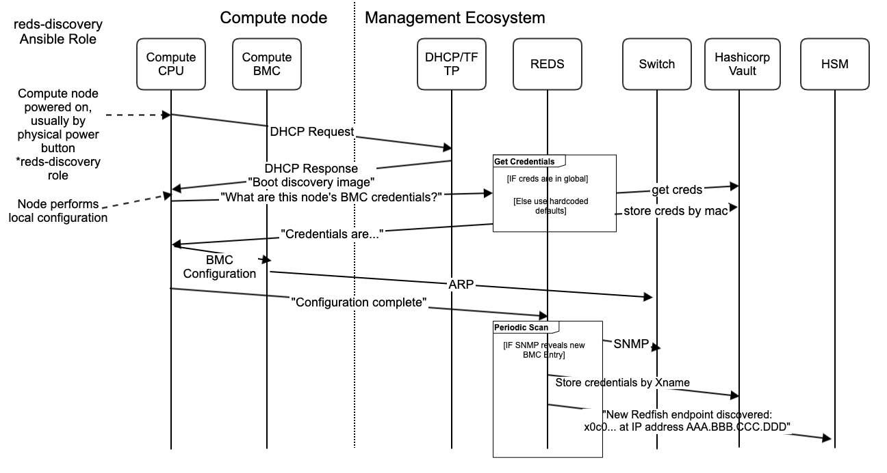
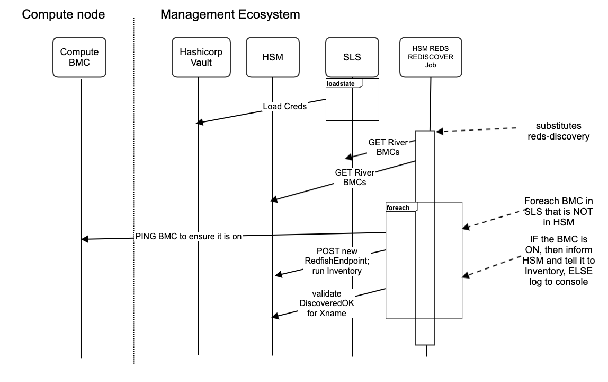

1.  [CASMHMS](index.html)
2.  [CASMHMS Home](CASMHMS-Home_119901124.html)
3.  [Design Documents](Design-Documents_127906417.html)
4.  [Discovery](Discovery_227479292.html)

#  CASMHMS : Understanding River Discovery, Inventory, and Provision Complexity as it Relates to System Installation and Management 

Created by  Andrew Nieuwsma, last modified
on Mar 18, 2020

*Authors: Andrew Nieuwsma, Sean Wallace, *Matt Kelly* | Date:
2019-10-23*

The narrative we are trying to explain is why River DIP (Discovery,
Inventory, & Provision) is complex, what can be done to automate the
process, and how this impacts the installation and management of a
Shasta system. In this document we will take several very deep dives
into the structure of Shasta. We have done our best to accurately
represent the facts and concepts herein, but Shasta is BIG.

**DISCLAIMER: This document is
describing Shasta &gt;= v1.1; This IS NOT applicable to v1.0**

**DISCLAIMER: This document is
describing processes, workflows, and system functionality for River
ONLY. This does not include specific conversation regarding Mountain
DIP**

## What you will get from reading this document

This document will communicate:

1.  the main use cases driving DIP
2.  the current process for DIP(as of 2019-10-23) including:
    1.  Key assumptions and requirements
    2.  the process flow from 'button push' to BOS 
3.  Key limitations and problems that make automation difficult
4.  Discussion of how to increase automation of the key use cases and
    limitations to this effort
    1.  SLS being the 'single source of truth' for system configuration
    2.  Developing processes to map MAC, xname, port, BMC credentials

## Definitions

-   `discovery` - the process of HSM become aware of the component (aka
    node)
-   `inventory` - the process of HSM walking the BMC redfish endpoint
    and loading this information into HSM
-   `provision` - the process of assigning credentials and applying them
    to the BMC

# Use Cases

1.  Adding hardware to a system (out-of-box)
    1.  Adding new hardware to a new system
    2.  Adding a new rack of hardware
    3.  Adding a single blade 
2.  NCN re-install with previously discovered, inventoried, provisioned
    (DIP'd) hardware
3.  hardware swap
    1.  swap two existing nodes
    2.  swap an existing node with a brand new node 

# Current Process for ALL use cases

All following process & assumption are applicable only to:

1.  River only hardware:
    1.  compute nodes, BMCs, Rosetta TOR, 
2.  System running v1.1+ software (NO v1.0)
3.  GAP: doesn't include PDUs

## Assumptions for process to work:

The following configurations must be in-place and correct:

1.  DHCP
2.  REDS mapping
3.  node-nid mapping
4.  global credentials

These configurations are required by the point the service mesh is
brought into existence. Realistically these files are used by ansible in
Stage 2, so they need to be in place earlier than Stage 4.  **CRITICAL: These files are MANUALLY
generated, based on special knowledge of the system. IF the files DO NOT
exist, then installation will NOT work, nor will DIP!! Disclaimer: HMS
does not own these files generation**

### DHCP configuration

Generation process:

1.  `bss_ipxe.conf` comes from a config map, unknown how/what generates
    it
2.  TODO: all DHCP conf refers to BMC, HOW does the information get into
    the node management network for nodes? How do nodes know that they
    are going to get it? 

TODO enumerate this process better

### REDS mapping

Generation process:

1.  `mapping.json` starts in an Ansible directory
    1.  Contains: maps ports, port names, and xnames
2.  gets copied into a new directory
3.  gets referenced by a new play and turned into a config map
4.  which gets referenced by a loader that posts the data into REDS.

Requirements/Assumptions:

1.  For every switch, for every port, with something plugged into it, if
    reds is responsible for its configuration then it HAS TO HAVE an
    Xname associated with it in this file
2.  SNMP is used to discover these things on these ports.

TODO: 

1.  clarify this process a bit to depict the genesis
2.  include example
3.  link to REDS design doc.

### node-nid mapping

Generation process:

1.  `node_nid_map.json` starts in an Ansible directory
    1.  contains: mapping of nids to xnames assignment. 
2.  gets copied into a new directory
3.  gets referenced by a new play and turned into a config map
4.  which gets referenced by a loader that posts the data into HSM.

Requirements/Assumptions:

1.  without this random nids will be assigned 

TODO: 

1.  clarify this process a bit to depict the genesis
2.  include example

### global credentials

Generation process: 

1.  global credentials must be loaded into hashicorp
    vault `/global/ipmi` path
2.  GAP: NOT known how this works

Requirements/Assumptions:

1.  Very soon, code will be removed from REDS that provides hard coded
    passwords. If these credentials are not available, then REDS WILL
    FAIL discovery. This will cause BOS to fail.

## DIP Process | How it currently works today for all use cases

<table class="gliffy-macro-table" width="100%">
<colgroup>
<col style="width: 100%" />
</colgroup>
<tbody>
<tr class="odd">
<td><table class="gliffy-macro-inner-table">
<tbody>
<tr class="odd">
<td></td>
</tr>
</tbody>
</table></td>
</tr>
</tbody>
</table>

DIP refers to the following process: 

1.  initial power on of the River compute node is done by pushing the
    power button. The BMC was automatically powered on when the rack
    gets power via its breaker

2.  the compute node will attempt to:

    1.  DHCP lease (requires DHCP Configuration was done). Node will get
        a lease. Via TFTP it will pull down the ipxe image. IT knows
        what to pull down b/c of DHCP Configuration
    2.  Compute node will ipxe boot, and it chain loads it next
        instruction from BSS :
        1.  contact BSS 
        2.  if MAC address of compute node exists in HSM, 
            1.  THEN ... TODO
        3.  Else (fist time boot): BSS will tell the compute node to
            boot the `REDS client discovery image`
            1.  REDS client image will reach out to REDS in the service
                mesh and get configuration information including:
                username& password, etc. 
                1.  REDS will check the hashicorp
                    vault `/global/ipmi` path
                    1.  if the credentials are found it uses the
                        credentials from `/global/ipmi` path
                        1.  it returns this credentials set to the
                            compute node.
                    2.  else
                        1.  it returns a hard coded credentials in REDS
                            source code. NOTE: pending change so that if
                            credentials are NOT found, this steps
                            FAILS! 
                2.  REDS will return `some` credentials back to compute
                    node
                3.  REDS client image will use IPMI tool to set the
                    username & password of the BMC
                4.  REDS client will inform REDS that the configuration
                    was applied
                5.  REDS writes the credentials into `hsm_creds` path of
                    hashicorp vault by its BMC xname
                6.  REDS then informs HSM about the BMC. @this point HSM
                    can do inventory! 
                7.  Typically on a normal configuration it powers off
                    the compute node

3.  Normally as part of the install the Ansible play waits
    for `DiscoveredOK` on the BMC in `hsm/RedfishEndpoints/{xname}`, for
    ALL nodes in the known population! If any of the nodes failed ^^
    process, then INSTALLATION FAILS! At this point Discovery (HSM is
    aware of all components (aka nodes)), Inventory (HSM has walked all
    of the BMC redfish path and loaded this into HSM for the BMC).
    Provision (credentials have been successfully applied to the BMC).
    At this point CAMPC can control the BMC, and the node.

4.  Now BOS takes over ...

# Limitations & Constraints

As previously stated, the key problems limiting/constraining the
automation of the DIP process is:

1.  Not knowing enough information about the system.
    1.  we do not know the credentials for the BMCs
        1.  we cannot assume defaults, because it is likely that upon
            a `re-install` the BMCs have a different password than
            defaults. Furthermore once we begin randomizing the
            passwords there is no way to guess the credentials
    2.  we do not have automatic DHCP configuration -&gt; this is still
        a manual process
    3.  We do not have automatic node-nid mapping -&gt; this is still a
        manual process

# Solutions

## USE CASE: adding new hardware, out-of-box

## USE CASE: NCN re-install with previously discovered, inventoried, provisioned (DIP'd) hardware

State of system at point of re-install: 

1.  DHCP
2.  REDS mapping
3.  node-nid mapping
4.  global credentials
5.  SLS contains the correct configuration for all the hardware
    1.  The BMC xname 
6.  hashicorp vault has all of the correct credentials for all xnames

**System state:**

The entire system is booted and running. Every stage of installation is
complete. All xnames have been discovered, inventoried, and provisioned.

**use cases:**

*Cray internal:*

For internal processes we do a fresh NCN re-install to validate the
installation process and the release blob.

*Customers:*

May perform this process as part of their site initial install, though
some security sensitive installations may require a fresh initial
install, similar to the out-of-box installation process (more on this
later). Also dumpstate/loadstate does not support re-configuration; e.g.
cannot change network ip ranges.

**Proposed Process (partial implementation in v1.1 hardening)**

<table class="gliffy-macro-table" width="100%">
<colgroup>
<col style="width: 100%" />
</colgroup>
<tbody>
<tr class="odd">
<td><table class="gliffy-macro-inner-table">
<tbody>
<tr class="odd">
<td></td>
</tr>
</tbody>
</table></td>
</tr>
</tbody>
</table>

  

**Details:**

1.  perform an SLS protected dumpstate
    1.  admin generates a public/private key pair
    2.  `POST`a request to `/sls/dumpstate` including the public key in
        the form data
        1.  SLS will return a payload of all state in SLS including any
            credentials matching xnames in hashicorp vault.
        2.  These credentials will be encrypted with the provided public
            key.
        3.  TODO Insert examples?
    3.  admin backs up their public/private key and the dumpstate from
        SLS
2.  perform a backup of DHCP configuration
    1.  GAP: there is no current process for this. Unclear ownership.
        Perhaps Network Management group
3.  perform a backup of node-nid mapping
    1.  GAP: this is no current process for this. Currently an admin
        would have to manually perform this by dumping the configuration
        from Kubernetes 
    2.  Proposed Plan v1.1 hardening: HMS will include backing up this
        configuration and exporting it as part of SLS dumpstate. Note:
        In order to backup this configuration, it must have been
        initially configured in the system.
4.  perform a backup of REDS mapping
    1.  GAP: this is no current process for this. Currently an admin
        would have to manually perform this by dumping the configuration
        from Kubernetes 
    2.  Proposed Plan v1.1 hardening: HMS will include backing up this
        configuration and exporting it as part of SLS dumpstate. Note:
        In order to backup this configuration, it must have been
        initially configured in the system.
5.  **GAP**: It is unknown if there are any other system critical
    configuration items that need to be backed up. To our knowledge this
    list is complete. 

At this point the configurations have been backed up, and the admin can
begin the NCN install process. 

{ interlude... admin performs install process }

GAP: there is a gap on how files (DHCP, REDS mapping, and node-nid
mapping) are restored onto the system. Currently the templated/default
files that produce the final configurations must be in place for Stage
2. It is unknown WHO owns this process. The REQUIREMENT is that DHCP,
RED mapping, and node-nid mapping MUST be in place and have successfully
gone through their installation processes before Stage 2 begins.

Future: Once the gaps have been filled so that node-nid mapping and REDS
mapping and DHCP configuration can be exfiltrated as part of the SLS
dumpstate, we can deprecate the Stage 2 dependencies. Instead the
dumpstate will be loaded into SLS (after Stage 4 has completed), and
load state in SLS after Stage 4 has completed. At this point SLS
datastore has been restored, however no services have been made aware of
this configuration. The services need to query SLS for the configuration
they need. TODO: wordsmith

SLS protected loadstate use cases:

1.  manual load
    1.  this will only be performed after the NCNs have been
        successfully installed and are operational. This process would
        be used to update the SLS datastore and eventually would allow
        dependent services to utilize SLS as the source of system
        configuration
2.  automatic load
    1.  this process will be used as part of the NCN re-install.

SLS protected loadstate for automatic load during NCN re-install
process:

1.  The SLS protected dumpstate file and private key (matching the
    public key that was used to generate the SLS protected dumpstate
    file) must be deployed on the system. Note: the private key should
    be considered invalidated at this point. The private/public key pair
    exists ONLY to facilitate the dumpstate/loadstate process. If SLS
    was not 'nuked' by the re-install, a public/private pair would not
    be necessary, but this is the only way to guarantee the chain of
    trust. 
2.  GAP: there is a gap on where to put the SLS protected dumpstate
    file. The file & the private key must be in place before the SLS
    loader runs as part of Stage 4.
3.  The SLS loader will load the dumpstate into SLS.

At this point, the rest of the services are deployed. TODO: document
that SLS needs to be stood up before all the other services

After service deployment the `hsm_redfish_rediscover.py` Kubernetes job
can be executed. It will:

1.  Scan HSM for all River ComputeBMCs
2.  Search SLS for all River ComputeBMCs
3.  For each BMC that exists in SLS, that does not exist in HSM
    1.  ping the ComputeBMC and ensure that it is reachable
    2.  inform HSM of the BMC (POSTs the RedfishEndpoint and tell HSM to
        run discovery).
4.  Query HSM for `DiscoveredOK` on the RedfishEndpoints that were
    'discovered'
5.  Timeout and report all nodes that did not get 'discovered'

At this point all the BMCs & compute nodes that could be discovered,
have been discovered. Services like CAPMC, FUS, can now interact with
the River ComputeNodes. 

Now BOS takes over ...

**Key takeaways:**

-   With the adoption of the proposed process we will:
    -   eliminate the need to manually power on the River Compute node
        during an NCN re-install
    -   eliminate the need to run REDS on a previously DIP'd river
        compute node during an NCN re-install. 

## Adding hardware to a system (out-of-box)

We need all of the information about all of the hardware (BMC for nodes
& switches (Rosetta)) including:

1.  username/password 
2.  mac address
3.  port
4.  xname
5.  desired ip address -&gt; not needed if we properly utilize DHCP by
    allowing it to inform DNS

# Why pushing the power button is necessary!

### Why do I have to PUSH the power button on the node in order to get it discovered, inventoried, and provisioned (DIP'd)?

#### tl;dr -&gt; Because we don't know enough information:

1.  we do not know the credentials for the BMCs
    1.  we cannot assume defaults, because it is likely that upon
        a `re-install` the BMCs have a different password than defaults.
        Furthermore once we begin randomizing the passwords there is no
        way to guess the credentials
2.  We still need to know other system information:
    1.  we do not have automatic DHCP configuration -&gt; this is still
        a manual process
    2.  We do not have automatic node-nid mapping -&gt; this is still a
        manual process

## Key questions

### Are there better alternatives to pushing the power button for `out-of-box` hardware? Not, unless we can fulfill the assumptions

#### There are other worse alternatives

1.  Setting nodes to `auto-power on`, requires the power button to be
    pushed, and then an additional lengthy process per node. If the rack
    is powered up before STAGE 4 has completed then the nodes will boot
    into a `press any key` situation which will require a reboot. The
    rack would still have to be powered on which would be a manual
    process

## However

### We can limit the impact of the PUSHing the power button to specific use cases

TODO fill out this section better; describe what we can fix

1.  hardware swap
    1.  swap two known nodes
        1.  the logical identity of the box is by the geo-location of
            the slot. The actual identity of the box is its configured
            xname, as related to its MAC Address. WHEN the hardware is
            moved several things MUST be updated (because the xname &
            MAC address are associated):
            1.  update DHCP conf to update the MAC Address for the
                associated xname. 
            2.  update hashicorp vault to reflect the correct
                credentials (again the physical box doesn't change), our
                knowledge of it must adapt. Currently NO way to do this.
    2.  swap one known node with one un-DIP'd node (DIP = Discovered,
        Inventoried, Provisioned)
        1.  modify DHCP conf entry for NEW box. Replace the MAC address
            for the xname it is replacing
        2.  load credentials into Hashicorp vault for new BOX, BUT we
            probably don't know it, so you MUST follow REDS process

## Attachments:

[reds\_sequence\_adn](attachments/154546446/154546452)
(application/gliffy+json)  

[reds\_sequence\_adn.png](attachments/154546446/154546453.png)
(image/png)  

[reds\_dip\_v1-0](attachments/154546446/154546521)
(application/gliffy+json)  

[reds\_dip\_v1-0.png](attachments/154546446/154546522.png) (image/png)  

[reds\_dip\_v1-0](attachments/154546446/154546524)
(application/gliffy+json)  

[reds\_dip\_v1-0.png](attachments/154546446/154546525.png) (image/png)  

[reds\_dip\_v1-0](attachments/154546446/154546527)
(application/gliffy+json)  

[reds\_dip\_v1-0.png](attachments/154546446/154546528.png) (image/png)  

[reds\_dip\_v1-0](attachments/154546446/154546529)
(application/gliffy+json)  

[reds\_dip\_v1-0.png](attachments/154546446/154546530.png) (image/png)  

[reds\_dip\_v1-0](attachments/154546446/154546535)
(application/gliffy+json)  

[reds\_dip\_v1-0.png](attachments/154546446/154546536.png) (image/png)  

[reds\_dip\_v1-1-immediate](attachments/154546446/154546587)
(application/gliffy+json)  

[reds\_dip\_v1-1-immediate.png](attachments/154546446/154546588.png)
(image/png)  

[reds\_dip\_v1-0](attachments/154546446/154546663)
(application/gliffy+json)  

[reds\_dip\_v1-0.png](attachments/154546446/154546664.png) (image/png)  

[reds\_dip\_v1-1-immediate](attachments/154546446/154546589)
(application/gliffy+json)  

[reds\_dip\_v1-1-immediate.png](attachments/154546446/154546590.png)
(image/png)  

[reds\_dip\_v1-1-immediate](attachments/154546446/154546592)
(application/gliffy+json)  

[reds\_dip\_v1-1-immediate.png](attachments/154546446/154546593.png)
(image/png)  

[reds\_dip\_v1-1-immediate](attachments/154546446/154546601)
(application/gliffy+json)  

[reds\_dip\_v1-1-immediate.png](attachments/154546446/154546602.png)
(image/png)  

[reds\_dip\_v1-1-immediate](attachments/154546446/154546605)
(application/gliffy+json)  

[reds\_dip\_v1-1-immediate.png](attachments/154546446/154546606.png)
(image/png)  

[reds\_dip\_v1-1-immediate](attachments/154546446/154546610)
(application/gliffy+json)  

[reds\_dip\_v1-1-immediate.png](attachments/154546446/154546611.png)
(image/png)  

[reds\_dip\_v1-1-immediate](attachments/154546446/154546617)
(application/gliffy+json)  

[reds\_dip\_v1-1-immediate.png](attachments/154546446/154546618.png)
(image/png)  

[reds\_dip\_v1-1-immediate](attachments/154546446/154546622)
(application/gliffy+json)  

[reds\_dip\_v1-1-immediate.png](attachments/154546446/154546623.png)
(image/png)  

[reds\_dip\_v1-1-immediate](attachments/154546446/154546630)
(application/gliffy+json)  

[reds\_dip\_v1-1-immediate.png](attachments/154546446/154546631.png)
(image/png)  

[reds\_dip\_v1-1-immediate](attachments/154546446/154546633)
(application/gliffy+json)  

[reds\_dip\_v1-1-immediate.png](attachments/154546446/154546634.png)
(image/png)  

[reds\_dip\_v1-1-immediate](attachments/154546446/154546638)
(application/gliffy+json)  

[reds\_dip\_v1-1-immediate.png](attachments/154546446/154546639.png)
(image/png)  

[reds\_dip\_v1-1-immediate](attachments/154546446/154546645)
(application/gliffy+json)  

[reds\_dip\_v1-1-immediate.png](attachments/154546446/154546646.png)
(image/png)  

[reds\_dip\_v1-1-immediate](attachments/154546446/154546650)
(application/gliffy+json)  

[reds\_dip\_v1-1-immediate.png](attachments/154546446/154546651.png)
(image/png)  

[reds\_dip\_v1-1-immediate](attachments/154546446/154546657)
(application/gliffy+json)  

[reds\_dip\_v1-1-immediate.png](attachments/154546446/154546658.png)
(image/png)  

[reds\_dip\_v1-1-immediate](attachments/154546446/154546666)
(application/gliffy+json)  

[reds\_dip\_v1-1-immediate.png](attachments/154546446/154546667.png)
(image/png)  

[reds\_dip\_v1-0](attachments/154546446/168770201)
(application/gliffy+json)  

[reds\_dip\_v1-0.png](attachments/154546446/168770202.png) (image/png)  

[reds\_dip\_v1-1-immediate](attachments/154546446/154546532)
(application/gliffy+json)  

[reds\_dip\_v1-1-immediate.png](attachments/154546446/154546533.png)
(image/png)  

[reds\_dip\_v1-0](attachments/154546446/154546499)
(application/gliffy+json)  

[reds\_dip\_v1-0.png](attachments/154546446/154546500.png) (image/png)  

Document generated by Confluence on Jan 14, 2022 07:17

[Atlassian](http://www.atlassian.com/)
